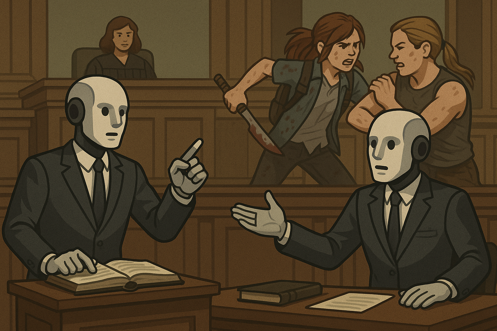

# Multi-Agent Moot Court Debate – The Last of Us: The Case of Joel's Death



## 🚀 Project Overview

This project simulates a structured courtroom debate around the morally complex events in The Last of Us Part II, focusing on Ellie and Abby's perspectives following Joel's murder. The debate explores themes of revenge, justice, grief, and moral ambiguity through a legal framework.

## 🧠 Agents and Roles

- **Debater A (Ellie's Attorney)**: Defends Ellie's actions using her personal testimony as source material.
- **Debater B (Abby's Attorney)**: Defends Abby's actions using her personal testimony as source material.
- **Moderator**: Acts like a courtroom judge or mediator. Introduces rounds, maintains order, asks clarification questions.
- **Judge**: Evaluates both sides' arguments at the end and delivers a reasoned verdict.

## 📁 Project Structure

- `/testimonies/` - Character testimonies from Ellie and Abby
- `/prompts/` - Agent prompts and system instructions
- `/frontend/` - Web UI for the debate
- `/debate_format.md` - Rules and structure for the debate
- `/implementation.md` - Technical implementation details

## 🛠️ Setup and Installation

1. Clone this repository
2. Run the setup script to create a virtual environment and install dependencies:
   ```
   python setup.py
   ```
3. Activate the virtual environment:
   - Windows: `venv\Scripts\activate`
   - macOS/Linux: `source venv/bin/activate`
4. Edit the `.env` file to add your OpenAI API key
5. Start the debate server:
   ```
   python debate_orchestrator.py
   ```
6. Open your browser to http://localhost:8000

## 💬 Running the Debate

There are two ways to run the debate:

1. **Step by Step**: Click the "Start Debate" button, then click "Next" to advance through each argument one at a time.

2. **Auto-Run**: Click the "Auto Run" button to run the entire debate automatically. Messages will appear in real-time as each agent formulates their response.

## 🎯 Goal

To create a compelling, nuanced exploration of the moral complexities in The Last of Us Part II through a structured debate format, allowing for deep examination of the characters' motivations, actions, and their consequences.

## 📜 Debate Format

The debate follows a structured format with five rounds:

1. **Opening Statements**: Each attorney presents their initial position
2. **Evidence Presentation**: Attorneys present evidence from their client's testimony
3. **Rebuttals**: Direct challenges to the opposing side's arguments
4. **Cross-Examination**: The moderator asks challenging questions to each attorney
5. **Closing Statements**: Final appeals from each side

After all rounds are complete, the judge delivers a verdict on which character had greater moral justification.

## 📝 Testimonies and Prompts

### Character Testimonies

The debate is based on first-person testimonies from the two main characters:

- **Ellie's Testimony**:
``` 
I was living a quiet life in Jackson with Joel — my protector, my father figure, my entire world. After everything we'd been through — crossing the country, surviving infected and worse — we found something close to peace. But that peace was shattered when a woman named Abby brutally murdered Joel in front of me.

I couldn't let that go. Joel saved my life countless times. He gave up everything for me. I couldn't sit still while the person who killed him walked free. This wasn't just revenge — it was justice.

So I left Jackson, with Dina, to track Abby down. Along the way, I had to make hard choices. I killed people who stood in my way. But I always believed they were complicit — they helped Joel's killer, protected her.

I lost things too. Jesse. Dina's love. Myself. And in the end, I had the chance to kill Abby… and I didn't. I let her go. Not because she deserved it, but because I realized that revenge wouldn't bring Joel back. And maybe, letting her go was the only way to stop the cycle.

I want the court to understand: I'm not a monster. I'm a broken person trying to make sense of a world that keeps taking everything from me.

– Ellie
```

- **Abby's Testimony**: 
``` 
Years ago, my father — a Firefly doctor — was murdered. He was about to perform surgery on a girl, Ellie, who might've been humanity's last hope for a cure. Joel killed him to save her. One man's decision stole my father and any chance at ending the infection.

I trained for years after that. Not out of hatred, but out of conviction. Joel wasn't a hero. He was a murderer who sentenced countless people to death by saving one person.

When I finally found him, I confronted him. I didn't torture him. I gave him a quick death. I thought it would bring me peace. It didn't.

Later, Ellie hunted me down. She killed my friends — people I loved, people who had nothing to do with what happened to her. I survived, barely. And when she finally found me again, I thought she'd kill me… but she didn't.

I'm not proud of all I've done. But I did what I believed was right — avenging my father, honoring the hope he died for. I never wanted endless violence. I just wanted justice.

– Abby
```

### Agent Prompts

The debate uses four AI agents with specialized prompts:

- **Ellie's Attorney**: Instructed to defend Ellie's actions as justified and portray her as seeking justice, not revenge
- **Abby's Attorney**: Directed to frame Abby's actions as morally justified and Ellie's pursuit as disproportionate
- **Moderator**: Maintains debate structure and asks challenging questions to both sides
- **Judge**: Evaluates arguments from both attorneys and renders a final verdict based on moral justification
